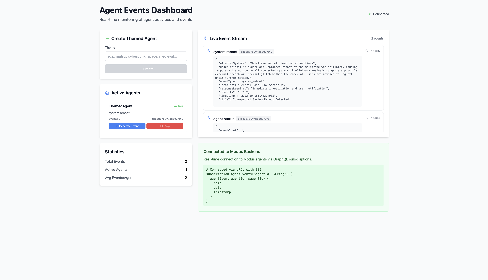

# Agent Events Dashboard

Real-time monitoring dashboard for Modus agents. Create themed agents and watch their events in
real-time.

<p align=center>
  
</p>

## Tech Stack

- **Frontend**: Next.js 15 + TypeScript + Tailwind CSS
- **Backend**: Modus (Go) + GraphQL
- **Real-time**: Server-Sent Events (SSE) via `graphql-sse` + URQL
- **AI**: OpenAI GPT-4o-mini for event generation

## Setup

1. **Install dependencies**

   ```bash
   npm install -g pnpm
   pnpm install
   ```

2. **Configure OpenAI API**

```bash
cd modus
echo "MODUS_OPENAI_KEY=your-openai-api-key" > .env
```

## Running

Start both servers:

```bash
# Terminal 1: Backend
cd modus
modus dev

# Terminal 2: Frontend
pnpm dev:frontend
```

Visit `http://localhost:3000`

## Usage

1. **Create Agent**: Enter a theme (e.g., "cyberpunk", "space station") and click Create
2. **Generate Events**: Click "Generate Event" or agents auto-generate themed events
3. **Monitor**: Watch real-time events in the dashboard

## Real-time Architecture

The app uses **Server-Sent Events (SSE)** for real-time updates:

- **URQL** GraphQL client with `subscriptionExchange`
- **graphql-sse** for SSE-based GraphQL subscriptions
- Events stream from Modus backend via `/graphql` endpoint

```typescript
// SSE client setup
const sseClient = createSSEClient({
  url: "http://localhost:8686/graphql",
})

// URQL with SSE subscriptions
const client = createClient({
  url: "http://localhost:8686/graphql",
  exchanges: [
    cacheExchange,
    fetchExchange,
    subscriptionExchange({
      forwardSubscription(operation) {
        return {
          subscribe: (sink) => {
            const dispose = sseClient.subscribe(operation, sink)
            return { unsubscribe: dispose }
          },
        }
      },
    }),
  ],
})
```

**SSE Event Stream Example:** You can view the raw SSE stream per agent in browser dev tools:

```text
event: next
data: {
  "data": {
    "agentEvent": {
      "name": "agent_status",
      "data": {
        "eventCount": 2,
        "maxEvents": 100,
        "status": "generating",
        "theme": "matrix",
        "timeElapsed": "3m46s"
      },
      "timestamp": "2025-06-12T10:46:57.973Z"
    }
  }
}

event: next
data: {
  "data": {
    "agentEvent": {
      "name": "system_malfunction",
      "data": {
        "affectedUsers": "Approximately 350 users",
        "description": "A critical subroutine designed to manage digital reality parameters encountered a malfunction",
        "errorCode": "MTRX-404-GLITCH",
        "eventType": "system_malfunction",
        "location": "Virtual Reality Hub, Sector 7",
        "severity": "HIGH",
        "timeOfIncident": "2023-10-15T14:30:00Z",
        "title": "Subroutine Failure in Simulation"
      },
      "timestamp": "2025-06-12T10:47:01.029Z"
    }
  }
}
```

## GraphQL API

**Queries:**

```graphql
query {
  agents {
    id
    name
    status
  }
}
```

**Mutations:**

```graphql
mutation {
  createThemedAgent(theme: "cyberpunk")
}

mutation {
  mutateStartEventGeneration(agentId: "agent_123")
}
```

**Subscriptions:**

```graphql
subscription {
  agentEvent(agentId: "agent_123") {
    name
    data
    timestamp
  }
}
```
