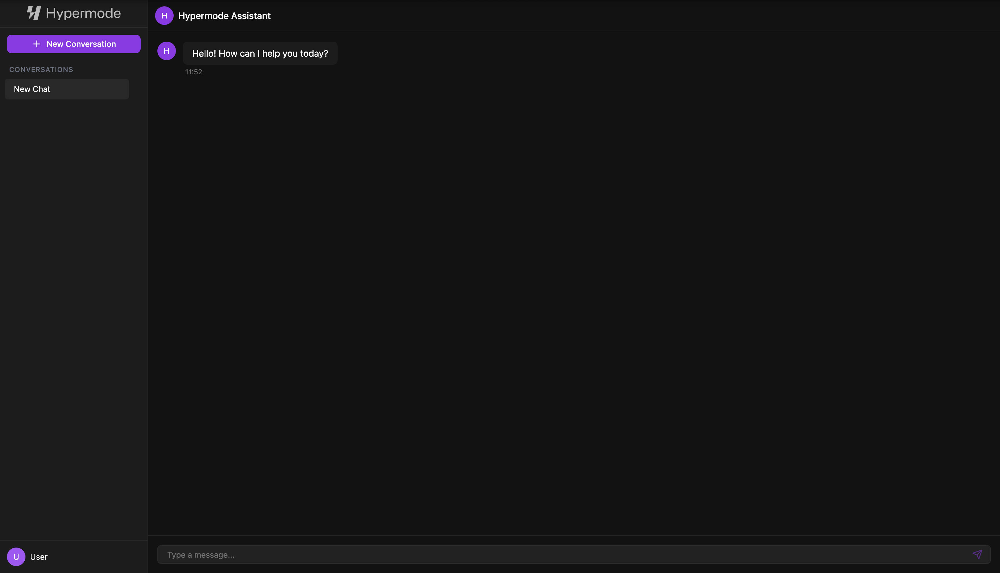

# Hypermode Chat Demo

A modern, chat interface built with React, Next.js, and the **aichatkit** component library. This
demo showcases how to build sophisticated AI-powered chat applications using modular, composable
components.

<p align=center>
  
</p>

## Overview

This project demonstrates a complete chat application implementation using:

- **Frontend**: Next.js 15 with React 19 and TypeScript
- **UI Components**: aichatkit component library for chat interface
- **Styling**: Tailwind CSS with Hypermode's dark theme
- **Backend Communication**: GraphQL via Apollo Client
- **Data Persistence**: Browser localStorage for conversation history
- **Icons**: Lucide React for modern iconography

## About aichatkit

This demo is built with [aichatkit](https://www.npmjs.com/org/aichatkit), a modular component
library designed for building AI-powered chat interfaces. The library provides:

- **Composable Components**: Chat bubbles, avatars, input areas, and complete interfaces
- **Flexible Adapters**: Pluggable network and storage adapters for various backends
- **Modern Design**: Clean, accessible UI with dark/light theme support
- **TypeScript Support**: Full type safety for better developer experience

### aichatkit Packages Used

- `@aichatkit/ui` - React components for chat interfaces
- `@aichatkit/apollo-adapter` - GraphQL communication via Apollo Client
- `@aichatkit/localstorage-adapter` - Browser storage for conversation persistence
- `@aichatkit/types` - Shared TypeScript type definitions

## Architecture

### Backend Communication

The application uses the **Apollo Adapter** from aichatkit to handle all backend communication:

```typescript
const apolloAdapter = new ApolloAdapter({ apolloClient });
```

The adapter automatically handles:

- **GraphQL Queries**: Sends chat messages via GraphQL mutations/queries
- **Error Handling**: Automatic retries and error management
- **Authentication**: Bearer token authentication (configurable via environment variables)
- **Response Processing**: Formats API responses into chat message objects
- **Custom Mutations**: Override the default GraphQL query to match your backend schema

#### Expected GraphQL Schema

The Apollo adapter expects your GraphQL API to implement a chat endpoint:

```graphql
query Chat($query: String!, $chatHistory: String!) {
  chat(query: $query, chat_history: $chatHistory) {
    message
    history
  }
}
```

#### Custom GraphQL Mutations

You can override the default chat query to match your backend's schema:

```typescript
import { gql } from "@apollo/client";

const customChatQuery = gql`
  mutation SendMessage(
    $query: String!
    $conversationId: ID!
    $history: String!
  ) {
    sendMessage(
      input: {
        message: $query
        conversationId: $conversationId
        history: $history
      }
    ) {
      response
      updatedHistory
    }
  }
`;

const apolloAdapter = new ApolloAdapter({
  apolloClient,
  chatQuery: customChatQuery,
});
```

This allows you to:

- Use mutations instead of queries
- Change variable names and structure
- Adapt to different response formats
- Add additional parameters like user IDs or conversation metadata

### Data Flow

1. **User Input**: User types message in the chat interface
2. **Local Storage**: Message is immediately stored locally for persistence
3. **API Call**: Apollo adapter sends message + conversation history to GraphQL endpoint
4. **Response**: Assistant's response is received and displayed
5. **Storage Update**: Complete conversation history is updated in localStorage

### Component Architecture

The demo uses aichatkit's `ChatInterface` component, which orchestrates:

- **ChatSidebar**: Conversation list and management
- **ChatBubble**: Individual message display
- **Avatar**: User and assistant avatars
- **Input**: Message input with send functionality
- **LoadingIndicator**: Typing indicators during API calls

## Getting Started

### Prerequisites

- Node.js 18+ or 20+
- npm, yarn, or pnpm package manager

### Installation

```bash
# Clone or download the project
git clone https://github.com/hypermodeinc/modus-recipes.git
cd hypermode-chat

# Install dependencies
npm install
```

### Environment Setup

Create a `.env.local` file in the root directory:

```bash
NEXT_PUBLIC_GRAPHQL_API_URL=http://localhost:8686/graphql
NEXT_PUBLIC_GRAPHQL_API_TOKEN=your-api-token-here
```

### Development

```bash
# Start the development server
npm run dev
```

Open [http://localhost:3000](http://localhost:3000) to view the application.

## Configuration

### GraphQL Endpoint

The application is configured to work with any GraphQL API that implements the expected chat schema.
Update the environment variables to point to your backend:

- `NEXT_PUBLIC_GRAPHQL_API_URL`: Your GraphQL endpoint URL
- `NEXT_PUBLIC_GRAPHQL_API_TOKEN`: Authentication token (optional)

### Customization

The demo can be easily customized:

#### Styling

- Modify `tailwind.config.ts` to adjust colors and themes
- Edit `src/app/globals.css` for global styles
- The Hypermode theme uses CSS custom properties for easy customization

#### Components

- Replace icons by importing different components from `lucide-react`
- Customize avatars, headers, and sidebar content via props
- Add custom message formatting or additional UI elements

#### Adapters

- Swap the Apollo adapter for REST API communication
- Change from localStorage to database persistence
- Add custom authentication or middleware

## Learn More

### aichatkit

- [NPM Organization](https://www.npmjs.com/org/aichatkit) - Browse all available packages
- [Documentation](https://www.npmjs.com/package/@aichatkit/ui) - Component API reference

### Next.js

- [Next.js Documentation](https://nextjs.org/docs) - Learn about Next.js features and API
- [Learn Next.js](https://nextjs.org/learn) - Interactive Next.js tutorial

### Apollo GraphQL

- [Apollo Client Documentation](https://www.apollographql.com/docs/react/) - GraphQL client setup
  and usage
