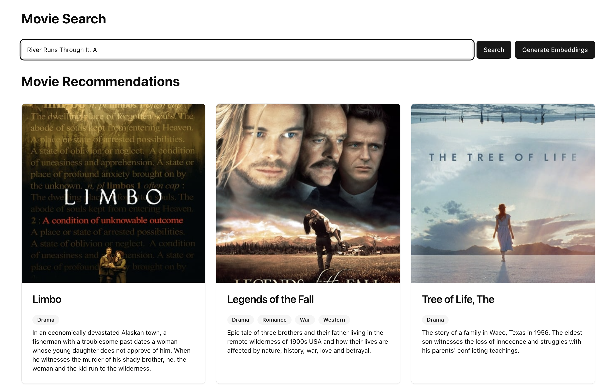

# Modus Neo4j Movie Search - Frontend

The frontend for this recipe is a Next.js app that uses Apollo Client to interact with our Modus API
app.



## Getting Started

Set environment variables for the Modus GraphQL API and API token

> Note: if running locally the API token is not needed.

```sh
NEXT_PUBLIC_GRAPHQL_API_URL=<YOUR_GRAPHQL_URI_HERE>
NEXT_PUBLIC_GRAPHQL_API_KEY=<YOUR_API_TOKEN_HERE>
```

Install project dependencies

```sh
npm i
```

Start the Next.js app

```sh
npm run dev
```

This will start a local web server at `http://localhost:3000` with your Modus Neo4j movie app! Click
the "Generate Embeddings" to generate embeddings and save to Neo4j before searching for movies. By
default only 200 movies embeddings are generated with each request, however this can be adjusted in
`components/movie-search.tsx`
